# SUP-002 Distribution 

## Goal 
Goal of this lab to is to create a release bundle and distribute the release bundle version 1.0 to the available edge nodes and validate using the Jfrog UI 

### Prerequisites 

### Section 1 - Environment ready check 

- Login to your saas instance **{{instance_name}}**.jfrog.io with  your admin credentials
- Click on Artifacts on the left hand side menu 
  <Insert image>
- Make sure below repositories and its content are created as shown in the image 
  
      - sup002-swampup-maven-dev-local
  
      - sup002-swampup-npm-dev-local
  
  

*******************************************************************************************************************
**NOTE: If you do not see teh data configured in the above step then please go through the section 2 and create the data . 
Or You can use SU-201-Intro-to-JFrog-Xray/scripts/setup.sh to populate repositories using JFROG CLI **
.You can skip Section 2 and go to section 3 if teh required data is present in the instance as shown in section 1  
*******************************************************************************************************************

### TO-DO - Section 2 - Create Repositories in JFrog Artifactory ( Run the below steps only if section 1 validation is not succeeded) 

- Login to your saas instance **{{instance_name}}**.jfrog.io with  your admin credentials
- Nevigate to Welcome, **{{user}}** from top right
- Click on dropdown and select **Quick Setup**
- Select Package Type **NPM** click **Next**
- Enter repository name **su201** and click **Create**
- Download the hello world apps and upload 
- Now, lets create NPM package 
- Enter repository name **su201** and click **Create**
- Download the hello world apps and upload 

### Section 3 
  
- Go to Distribution Menu -> Release Bundles on the left side menu 
  
  
    
 -  Create a Release bundle 
  
   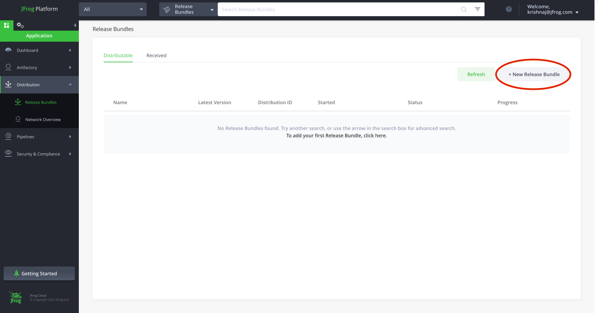 

- Enter Name,Version and Description as shown and click Add AQL Query 

   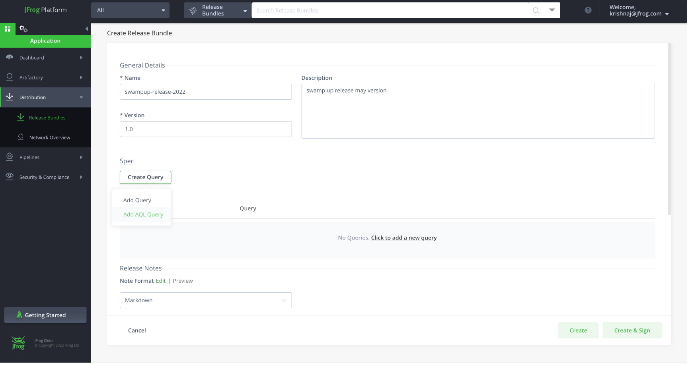

- Paste the below AQL Query and click Next . AQL Query fetches the required artifacts needed to be added to the bundle 
   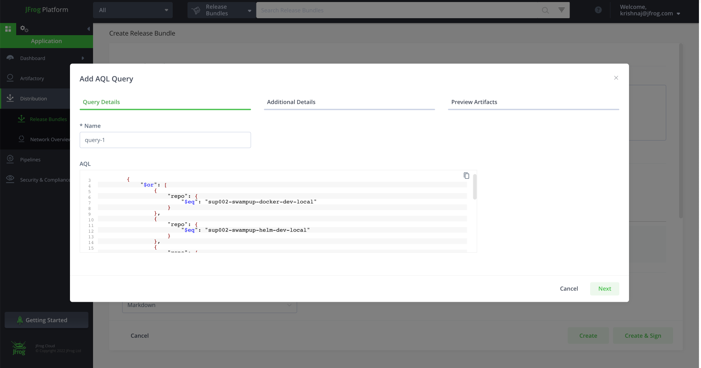
    
- Add the following key value pair and click NExt 
   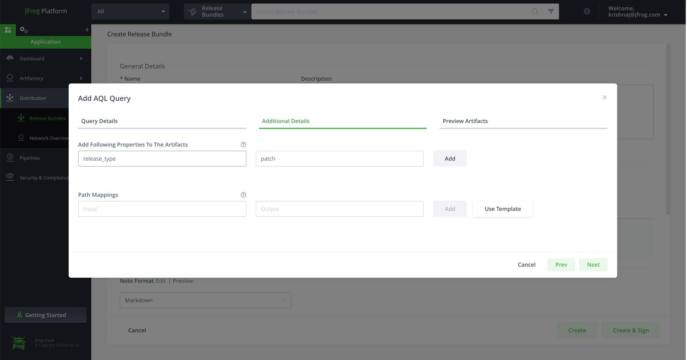

- Preview all the artifacts that AQL query collected and validate 
  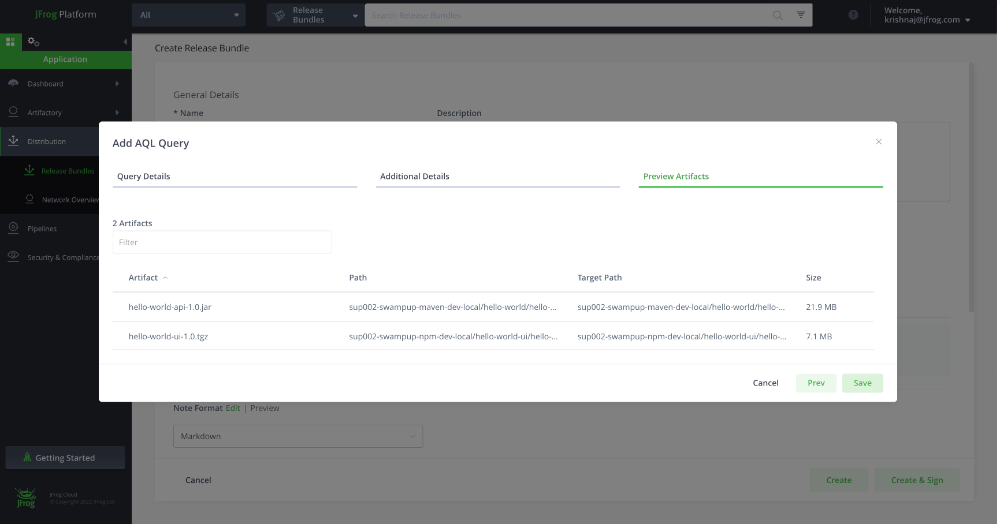

- Click on create and sign 
  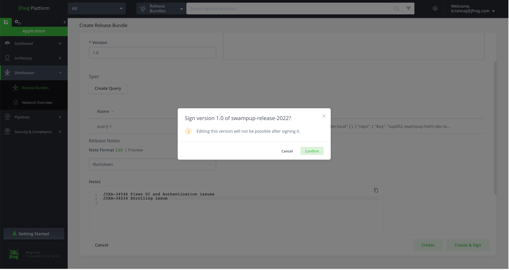

- Verify if release bundle is created 
    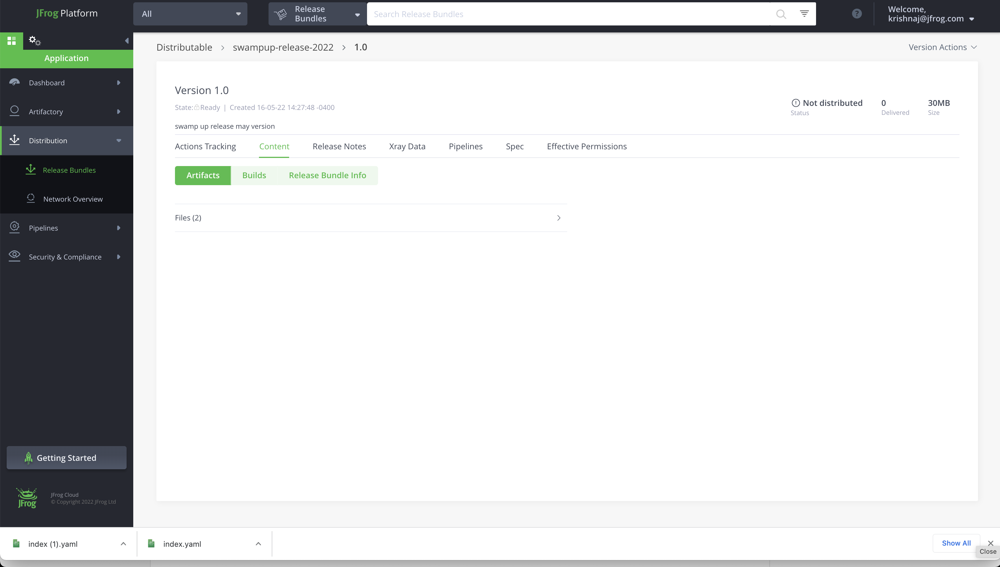

- Click on Distribute Release Bundle 
   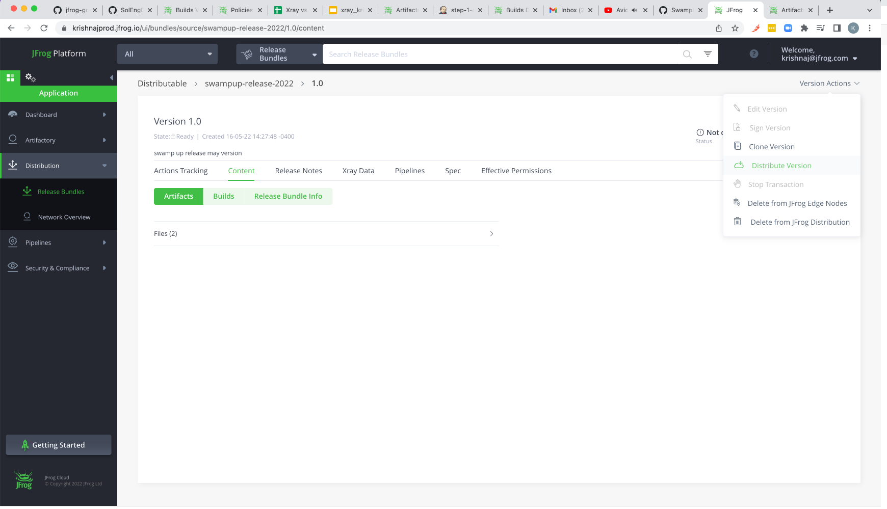

- select all the edge nodes
  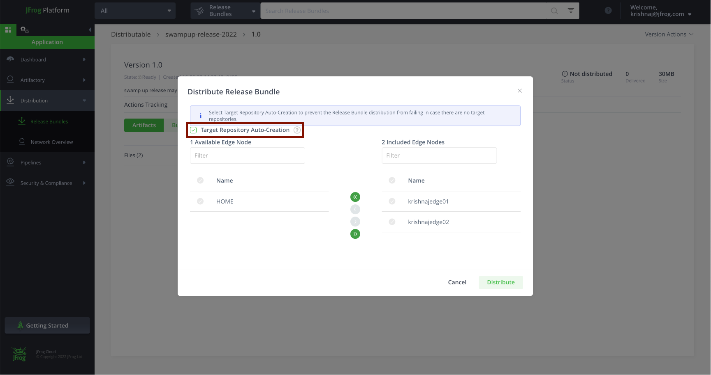
    
- Distrubute 
  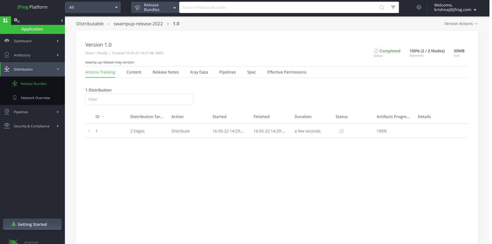
    
- validate the release bundle is distributed 
  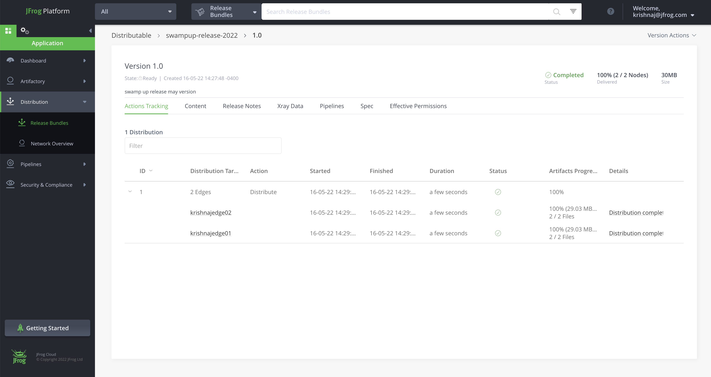
    
- click on release bundle to see it is distributed to edge nodes
  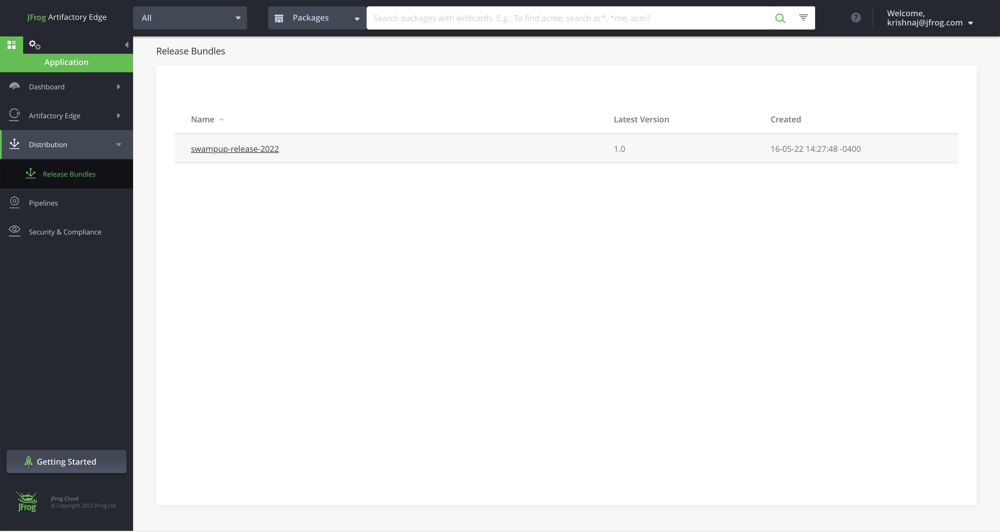

